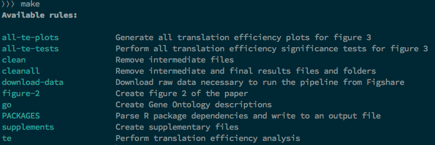

<!-- This file has been generated by the concat.sh script. -->
<!-- Don't modify this file manually (you'll loose your changes) -->
<!-- but run the tool once more -->
<!-- Last refresh date: Wednesday, August 02, 2023, 20:43:39 -->

# Makefile - Tutorial and Tips & Tricks


> Tutorial and collection of tips and tricks for how to use makefile

> [🇫🇷 - Prendre en main makefile](https://xieme-art.org/post/prendre-en-main-make/)

<!-- table-of-contents - start -->
* [Install the make executable](#install-the-make-executable)
* [Writing your first makefile](#writing-your-first-makefile)
  * [How to check if a file exists or not](#how-to-check-if-a-file-exists-or-not)
  * [How to check if a folder exists or not](#how-to-check-if-a-folder-exists-or-not)
  * [Running dependant targets](#running-dependant-targets)
    * [Stop the job if a target fails](#stop-the-job-if-a-target-fails)
    * [Using shell find option to get all dependancies](#using-shell-find-option-to-get-all-dependancies)
  * [Don't echo the command](#don-t-echo-the-command) 
  * [Using conditional statements](#using-conditional-statements)
  * [Ignore error](#ignore-error)
  * [Make sure you're using Bash](#make-sure-you-re-using-bash)
  * [Set the default target](#set-the-default-target)
  * [Substitution](#substitution)
  * [Tab not space](#tab-not-space)
  * [This is a comment](#this-is-a-comment)
  * [Using parameters](#using-parameters)
    * [Make sure the parameters is set](#make-sure-the-parameters-is-set)
* [Configure Visual Studio Code](#configure-visual-studio-code)
  * [Add the makefile extension](#add-the-makefile-extension)
  * [Add the .editorconfig file](#add-the-editorconfig-file)
* [Some tips](#some-tips)
  * [How to extend a target](#how-to-extend-a-target)
  * [Getting the current directory into a variable](#getting-the-current-directory-into-a-variable)
  * [Get a list of files and initialize a variable](#get-a-list-of-files-and-initialize-a-variable)
  * [Getting information's from the .env file](#getting-information-s-from-the-env-file)
    * [Define variable based on .env environment variables](#define-variable-based-on-env-environment-variables)
    * [Use a default value if the variable is not defined](#use-a-default-value-if-the-variable-is-not-defined)
      * [Override a variable](#override-a-variable)
  * [Verbose mode](#verbose-mode)
  * [Working with git](#working-with-git)
    * [Retrieve some important information](#retrieve-some-important-information)
    * [Some git targets](#some-git-targets)
    * [Git - Work in progress](#git-work-in-progress)
  * [Working with PHP project and vendors](#working-with-php-project-and-vendors)
    * [Updating the vendor folder only when needed](#updating-the-vendor-folder-only-when-needed)
    * [PHP - Quality checks](#php-quality-checks)
    * [region - Implement `Quality Assurance` features; relying on the jakzal/phpqa Docker image)](#region-implement-quality-assurance-features-relying-on-the-jakzal-phpqa-docker-image)
    * [Define the Docker image to use for PHPQA (https://github.com/jakzal/phpqa)](#define-the-docker-image-to-use-for-phpqa-https-github-com-jakzal-phpqa)
    * [The full "docker run" command to be able to run a command in the jakzal/phpqa container](#the-full-docker-run-command-to-be-able-to-run-a-command-in-the-jakzal-phpqa-container)
    * [Get the current user/group ID and define the docker "-u" argument](#get-the-current-user-group-id-and-define-the-docker-u-argument)
    * [Finally, the final command for running a command in the jakzal/phpqa container](#finally-the-final-command-for-running-a-command-in-the-jakzal-phpqa-container)
      * [Run PHAN and report problems](#run-phan-and-report-problems)
      * [Run PHP-CS-FIXER on the codebase IN A DRY-RUN MODE](#run-php-cs-fixer-on-the-codebase-in-a-dry-run-mode)
      * [Run PHP-CS-FIXER on the codebase and fix problems](#run-php-cs-fixer-on-the-codebase-and-fix-problems)
      * [PHP - Check the syntax of PHP files and report syntax errors if any](#php-check-the-syntax-of-php-files-and-report-syntax-errors-if-any)
      * [YAML - Check the syntax of yaml files in the directory root folder and report syntax errors if any](#yaml-check-the-syntax-of-yaml-files-in-the-directory-root-folder-and-report-syntax-errors-if-any)
    * [endregion](#endregion)
* [Some functions](#some-functions)
  * [Clean folders](#clean-folders)
  * [Open a web browser](#open-a-web-browser)
  * [Self documenting makefile](#self-documenting-makefile)
* [Tutorials](#tutorials)<!-- table-of-contents - end -->

## Install the make executable

Just run the following commands to install the `Make` executable on your host machine:

```bash
sudo apt-get update && sudo apt-get -y install make
```

## Writing your first makefile

### How to check if a file exists or not

You can use the `test -s` statement like below:

```makefile
    @test -s .config/phpunit.xml || echo "phpunit.xml didn't exists"
```

```makefile
    @test -s .config/phpunit.xml && echo "phpunit.xml exists"
```

Unlike the `ifeq` statement, `test` should be indented.

We can use the `{ ... }` notation if we need to run more than one command; f.i.:

```makefile
    @test -s .config/phpunit.xml || { echo "phpunit.xml file is missing, please take actions! Exiting..."; exit 1; }
```

We can also do this before, f.i., includes an external file:

```makefile
ifneq ("$(wildcard .env)","")
	include .env
endif
```

### How to check if a folder exists or not

You can use the `ifeq` statement with a Linux shell command like below:

```makefile
ifeq ($(shell test -e vendor/a/b/c || echo -n no),no)
    @echo "The folder didn't exists"
endif
```

```makefile
ifeq ($(shell test -e vendor/a/b/c && echo -n yes),yes)
    @echo "The folder exists"
endif
```

Unlike the `test` statement, `ifeq` should be used without indentation. Directly at position column zero.

### Running dependant targets

By running `make php-cs-fixer`, we'll first run `vendor` then `update-them`, finally `php-cs-fixer` i.e. we can define a list of dependant targets.

```makefile
php-cs-fixer: vendor update-them
	@echo "And finally run php-cs-fixer"

vendor:
	@echo "First get vendors"

update-them:
	@echo "Then update vendors"
```

Running `make php-cs-fixer` will output this:

```text
First get vendors
Then update vendors
And finally run php-cs-fixer
```

#### Stop the job if a target fails

If one of them fails, the script will stop.  In the example below, `php-cs-fixer` will never print `And finally run php-cs-fixer`.

```makefile
php-cs-fixer: vendor update-them
	@echo "And finally run php-cs-fixer"

vendor:
	@echo "First get vendors"

update-them:
	@echo "Then update vendors"
	exit 2 && echo "Oups, an error has occured"
```

Running `make php-cs-fixer` will output this:

```text
First get vendors
Then update vendors
And finally run php-cs-fixer
```

#### Using shell find option to get all dependancies

Imagine you've a lot of `.md` files in the directory. If one change, we'll concat them again. If nothing change, nothing to do.

This can be done using a shell command for the dependancy:

```makefile
concat: $(shell find *.md -type f)
	$(shell concat.sh)

```

(source [https://tech.davis-hansson.com/p/make/#specifying-inputs](https://tech.davis-hansson.com/p/make/#specifying-inputs))

### Don't echo the command 

Running `make helloWorld` like below will output two lines on the console.

```makefile
helloWorld:
	echo "Hello world"
```

```text
echo "Hello world"
Hello world
```

To avoid the first one i.e. the output of the fired instruction, just prefix it with an at sign (`@`).

```makefile
helloWorld:
	@echo "Hello world"
```

Now, only the output will be echoed; no more the instruction itself.

### Using conditional statements

We can make some conditional statement like this but, be careful on the indentation:

```makefile
init:
ifeq ($(shell expr $(SET_PHP_VERSION) \>= 8), 1)
	@printf "[1;${COLOR_YELLOW}m%s\n\n" "Upgrade dependencies to PHP 8"
else
	@printf "[1;${COLOR_YELLOW}m%s\n\n" "Downgrade dependencies to PHP 7"
endif
```

`make init SET_PHP_VERSION=7.4` will display the downgrade message while `make init SET_PHP_VERSION=8.1` the upgrade one.

Another examples:

```makefile
ifneq ("$(DB_TYPE)","")
	echo "The DB_TYPE variable is not empty
endif

ifeq ("$(DB_TYPE)","")
	echo "The DB_TYPE variable is empty
endif
```

### Ignore error

Don't stop in case of error: add a `-` before the line like :`-php --lint index.php`

```makefile
phplint:
	-php --lint index.php
	echo "Yes, this script will continue..."
```

In case of linting error in `index.php` don't stop the execution of the script and process the next command.


Note: makefile can perhaps well display a message like `make: [makefile:114: up] Error 1 (ignored)` to inform the user an error has occurred but has been skipped.  If you don't want it at all (silent output), this is how to do:

```makefile
[...]
	@-docker network create -d bridge my_network >/dev/null 2>&1 || true
[...]
```

This command will create a new Docker network called `my_network` and if case of error (the network already exists f.i.), we don't care and don't want to see any output.

### Make sure you're using Bash

By default, `make` is using `/bin/sh`. This can be upgraded by adding this assignation at the top of the `makefile`:

```makefile
SHELL:=bash
```

(source: [https://tech.davis-hansson.com/p/make/#always-use-a-recent-bash](https://tech.davis-hansson.com/p/make/#always-use-a-recent-bash))

### Set the default target

By default, the first target defined in the file will be the default one i.e. the one fired when the user will just fire `make` on the command line.

```makefile
default: bonjour

bonjour:
	@echo "Bonjour"
```

### Substitution

Consider `make convert INFILE=readme.md`

```makefile
outfile=$(INFILE:.md=.pdf)

COLOR_BLUE:=34

convert:
	@printf "[1;${COLOR_BLUE}m%s\n\n" "INPUT FILE IS ${INFILE}; OUTPUT WILL BE ${outfile}"
```

The syntax `outfile=$(INFILE:.md=.pdf)` will replace `.md` by `.pdf` so we can, in this example, derive the output file based on the input file.

### Tab not space

The indentation to use when creating a `makefile` is the tabulation; not spaces. Using spaces will broke the file. 

```makefile
helloWorld:
	echo "Hello world"
```

however it is possible to adapt this behavior using `.RECIPEPREFIX`:

```makefile
.RECIPEPREFIX = >

changeExt:
### This is a comment
> @printf "%s\n" "It works"
```

(source: [https://tech.davis-hansson.com/p/make/#dont-use-tabs](https://tech.davis-hansson.com/p/make/#dont-use-tabs))

### Using parameters

Running a target with a parameter should be done using named parameters like this:

```bash
make bonjour firstname="Christophe"
```

This will create a variable called `firstname`, we then can use it:

```makefile
bonjour:
	@echo "Bonjour ${firstname}"
```

#### Make sure the parameters is set

Imagine we want to run `make runsql SQL='SELECT * FROM users LIMIT 10'` i.e. the `SQL`argument should be defined otherwise we'll have a problem.

```makefile
COLOR_RED:=31
COLOR_YELLOW:=33

runsql:
	@[ "${SQL}" ] && printf "[1;${COLOR_YELLOW}m\n%s\n\n" "Running ${SQL}" || ( printf "[1;${COLOR_RED}m\n%s\n\n" "ERROR - Please set the SQL to execute; consult the help if needed"; exit 1 )
```

## Configure Visual Studio Code

### Add the makefile extension

[https://marketplace.visualstudio.com/items?itemName=ms-vscode.makefile-tools](https://marketplace.visualstudio.com/items?itemName=ms-vscode.makefile-tools)

### Add the .editorconfig file

Make sure your `Makefile` file is correctly formatted; add a file called `.editorconfig` in your root directory.

```text
[*]
end_of_line = lf
insert_final_newline = true

[Makefile]
indent_style = tab
indent_size = 4
```

## Some tips

### How to extend a target

You've an existing target, let's say `hello` in our example, and you wish to extend it and add extra actions.

`hello` can be defined in the same makefile or in an included one but let's illustrate this with a basic example: we wish to add the *Nice to meet you* output.

```makefile
hello:
	@echo "Hello world"

hello:
	@echo "Nice to meet you"
```

If we run that file, here is the output.

```bash
> make hello

makefile:198: warning: overriding recipe for target 'hello'
makefile:195: warning: ignoring old recipe for target 'hello'
Nice to meet you
```

The solution: use `::` (this is called an *explicit rule*) and not a single `:` after the recipe; see the next sample:

```makefile
hello::
	@echo "Hello world"

hello::
	@echo "Nice to meet you"

hello::
	@echo "Did you any plans for this week-end?"
```

If we run that file, here is the output.

```bash
> make hello

Hello world
Nice to meet you
Did you any plans for this week-end?
```

Recipes are just extended, the second one is appended to the first and so on so the order is important.

### Getting the current directory into a variable

```makefile
PWD:=$(shell pwd)

current_dir:
	@echo "The current directory is ${PWD}"
```

### Get a list of files and initialize a variable

Let's take a real use case: scan a folder called `.docker` and retrieve the list of `docker-compose*.yml` files there.

The objective is to initialize an environment variable called `COMPOSE_FILE` (see [https://docs.docker.com/compose/environment-variables/envvars/#compose_file](https://docs.docker.com/compose/environment-variables/envvars/#compose_file)) so, when running `docker compose` we can use all files at once (i.e. by not adding the `--file file1.yml --file file2.yml` and on)

So, getting the list of `docker-compose*.yml` can be done like this:

```makefile
DOCKER_YAML_FILES := $(shell find ./.docker -name 'docker-compose*.yml')
DOCKER_YAML_FILES := $(shell echo "$(DOCKER_YAML_FILES)" | tr ' ' ':')
```

The first line will return f.i. `docker-compose.yml docker-compose.override.yml docker-compose.mysql.yml`.

The second instruction will replace the space by a colon (`:`).

We'll thus obtain `docker-compose.yml:docker-compose.override.yml:docker-compose.mysql.yml`.

Now, to run `docker compose config` for instance, we just need to do the following i.e. first declare the `COMPOSE_FILE` environment variable then run the desired action.

```makefile
.PHONY: config
config:
 COMPOSE_FILE=${DOCKER_YAML_FILES} docker compose config
```

### Getting information's from the .env file

Getting a value from a `.env` file is easy, just include it then use variables:

```env
DOCKER_IMAGE=cavo789/my_image
```

```makefile
include .env

helloDocker:
	@echo "The name of the image is ${DOCKER_IMAGE}"
```

This `include` tip will works with any file defining a variable and his value

We can perfectly have a file called `Make.config`, not `.env`

#### Define variable based on .env environment variables

Let's imagine you've a variable called `APP_ENV` in your `.env` file.

That variable can be set to `local`, `test` or whatever you want. Will be set to `production` when the application is running in the production environment.

So, based on that variable, we can define a variable like this:

```makefile
ifeq ($(APP_ENV), production)
	CMD:=
else
	CMD:=docker compose exec my_docker_image
endif
```

This means: if we're not running in production, every command will be fired inside our Docker container. If running in production, the command will be executed directly.

Here is an example:

```makefile
composer-update:
	${CMD} composer update --no-interaction
```

#### Use a default value if the variable is not defined

If the OS environment variable `PHP_VERSION` is not defined, set its default value to `8.1`

```makefile
PHP_VERSION  :=$(or $(PHP_VERSION),8.1)
```

This will allow things like below i.e. target a custom version of a Docker image based on the selected PHP version.

```makefile
DOCKER_PHPQA:=jakzal/phpqa:php${PHP_VERSION}-alpine
```

##### Override a variable

Even if the variable is still defined, you can override it by passing it on the command line:

```bash
make yamllint PHP_VERSION=8.1
```

This will start the `yamllint` target with `PHP_VERSION` set to `8.1` even if the variable is already defined and f.i. set to `7.4`.

### Verbose mode

The idea: don't show informative message when running some targets.

The code below will check the presence of the `--quiet` argument / value in the `$ARGS` standard variable.

Sample code to demonstrate how to enable/disable verbose mode in a makefile.

Using the "--quiet" argument in ARGS.

* Verbose mode: run `make testme` on the command line
* Silent  mode: run `make testme ARGS="--quiet"` on the command line

```makefile
QUIET=$(if $(findstring --quiet,${ARGS}),true,false)

testme:
ifeq ($(QUIET),false)
	@printf '\e[1;30m%s\n\e[m' "QUIET MODE NOT ENABLED - We'll show any informative text."
endif
	@printf '\e[1;32m%s\n\n\e[m' "This is an important message"
```

The code above define a global variable `QUIET` that will be set to `true` or `false` depending on the presence of the `--quiet` keyword in `ARGS`.

Then, use the `ifeq` conditional structure to show (or hide) informative message.

By running `make testme ARGS="--quiet"` only *This is an important message* will be displayed.

### Working with git

#### Retrieve some important information

Retrieve some important variables from the shell:

```makefile
GIT_CURRENT_BRANCH:=$(shell git rev-parse --abbrev-ref HEAD)

GIT_ROOT_DIR:=$(shell git rev-parse --show-toplevel)

GIT_URL_REPO:=$(shell git config --get remote.origin.url | sed -r 's:git@([^/]+)\:(.*\.git):https\://\1/\2:g' | grep -Po '.*(?=\.)')
```

#### Some git targets

When variables have been initialized, we can do things like this:

```makefile
git_open_repo:
	@sensible-browser ${GIT_URL_REPO}

git_open_pipeline:
	@sensible-browser ${GIT_URL_REPO}/pipelines

git_open_wiki:
	@sensible-browser ${GIT_URL_REPO}/-/wikis/home
```

#### Git - Work in progress

Run `make git_wip` to quickly push your changes to the remote repository and skip the local hooks:

```makefile
git_wip:
	git add .
	git commit -m "wip --no-verify
	git push
```

### Working with PHP project and vendors

#### Updating the vendor folder only when needed

Having a target like below (i.e. called `vendor`) will result in a check *Should the vendor be upgraded or not?*.  This is done by first running the `composer.lock` target. The idea is then to compare the date/time of that file and `composer.json`.  If there is a difference, the `Make` tool will run `composer update` and will generate a newer version of `composer.lock` and thus a newer version of `vendor` too.

If no changes have been made to the `composer.json` file, nothing has to be done since `vendor` is considered up-to-date.

Pretty easy.

```makefile
composer.lock: composer.json
	${CMD} composer update --no-interaction

vendor: composer.lock
	${CMD} composer install
```

To run the scenario, just run `make vendor`.

#### PHP - Quality checks

The portion below can just be copied/pasted in your own `Makefile` to add quality controls features based on the [https://github.com/jakzal/phpqa](https://github.com/jakzal/phpqa) Docker image.

```makefile
COLOR_BLUE:=34
COLOR_CYAN:=36
COLOR_YELLOW:=33

#### region - Implement `Quality Assurance` features; relying on the jakzal/phpqa Docker image)
#### Define the Docker image to use for PHPQA (https://github.com/jakzal/phpqa)
#! PHP_VERSION should be defined in the `.env` file
PHP_VERSION:=$(or $(PHP_VERSION),8.1)

DOCKER_PHPQA:=jakzal/phpqa:php${PHP_VERSION}-alpine

#### The full "docker run" command to be able to run a command in the jakzal/phpqa container
DOCKER_PHPQA_ARGS:=-it --rm -v ${PWD}:/project -w /project -v ${PWD}/.output/tmp-phpqa:/tmp

#### Get the current user/group ID and define the docker "-u" argument
DOCKER_PHPQA_UID_GID:=-u $(shell id -u):$(shell id -g)

#### Finally, the final command for running a command in the jakzal/phpqa container
DOCKER_PHPQA_COMMAND:=docker run ${DOCKER_PHPQA_ARGS} ${DOCKER_PHPQA_UID_GID} ${DOCKER_PHPQA}

##### Run PHAN and report problems
phan:
	clear
    #### This is how to define a local variable
	$(eval COMMAND := $(shell echo "phan --progress-bar --config-file .config/phan.php"))
	@printf "[1;${COLOR_YELLOW}m%s\n\n" "Report PHAN errors in your PHP files (no fix) using $(DOCKER_PHPQA)"
	@printf "[1;${COLOR_YELLOW}m%s\n\n" "Running \"${COMMAND}\""
	@printf "[1;${COLOR_BLUE}m%s\n\n" "Note: make sure your /vendor folder is populated..."
	@docker run -it ${DOCKER_PHPQA_ARGS} ${DOCKER_PHPQA} phan --version
	@echo ""
	${DOCKER_PHPQA_COMMAND} ${COMMAND}

##### Run PHP-CS-FIXER on the codebase IN A DRY-RUN MODE
php-cs-fixer-dry-run:
	clear
    #### This is how to define a local variable
	$(eval COMMAND := $(shell echo "php-cs-fixer fix --verbose --config=/project/.config/.php-cs-fixer.php --using-cache=no --diff"))
	@printf "[1;${COLOR_YELLOW}m%s\n\n" "Report code formatting issues in your PHP files (no fix) using $(DOCKER_PHPQA)"
	@printf "[1;${COLOR_YELLOW}m%s\n\n" "Running \"${COMMAND} --dry-run\""
	${DOCKER_PHPQA_COMMAND} ${COMMAND} --dry-run

##### Run PHP-CS-FIXER on the codebase and fix problems
php-cs-fixer-fix:
	clear
    #### This is how to define a local variable
	$(eval COMMAND := $(shell echo "php-cs-fixer fix --verbose --config=/project/.config/.php-cs-fixer.php --using-cache=no --diff"))
	@printf "[1;${COLOR_YELLOW}m%s\n\n" "Automatically fix formatting issues in your PHP files using $(DOCKER_PHPQA)"
	@printf "[1;${COLOR_YELLOW}m%s\n\n" "Running \"${COMMAND}\""
	${DOCKER_PHPQA_COMMAND} ${COMMAND}

##### PHP - Check the syntax of PHP files and report syntax errors if any
phplint:
	clear
	@printf "[1;${COLOR_YELLOW}m%s\n\n" "Check syntax validity of php files using $(DOCKER_PHPQA)"
    #### https://github.com/overtrue/phplint
	${DOCKER_PHPQA_COMMAND} phplint --no-cache --exclude=vendor

##### YAML - Check the syntax of yaml files in the directory root folder and report syntax errors if any
yamllint:
	clear
	@printf "[1;${COLOR_YELLOW}m%s\n\n" "Check syntax validity of yaml files using $(DOCKER_PHPQA)"
    #### https://github.com/j13k/yaml-lint
    #### (it seems yaml-lint can't search in all the tree structure and *.yml won't get .gitlab-ci.yml; strange)
	${DOCKER_PHPQA_COMMAND} yaml-lint .*.yml *.yml .install/CI/*.yml
#### endregion
```

## Some functions

### Clean folders

```makefile
COLOR_YELLOW:=33

clean:
	@printf "[1;${COLOR_YELLOW}m%s\n\n" "Remove node_modules and vendor folders"
	rm --recursive --force node_modules/ vendor/
	@printf "[1;${COLOR_YELLOW}m\n%s\n\n" "Empty .cache, .output and storage/logs"
	rm --recursive --force .cache/* .output/* storage/logs/*
```

We can also test for the existence of the folder first:

```makefile
clean:
	test ! -e vendor || rm -rf vendor
```

### Open a web browser

```makefile
open-browser:
	@sensible-browser http://www.google.fr
	@echo "The site has been opened in your browser"
```

This is pretty useful when you work with git repositories:

```makefile
GIT_URL_REPO:=$(shell git config --get remote.origin.url | sed -r 's:git@([^/]+)\:(.*\.git):https\://\1/\2:g' | grep -Po '.*(?=\.)')

git_open_repo: 
	@sensible-browser ${GIT_URL_REPO}
```

### Self documenting makefile

You can use a tip for creating a target like `help`. The idea is to scan the current `makefile` and extract the list of all verbs and their description.



There are a few different ways to achieve this. One working solution is to use [https://gist.github.com/klmr/575726c7e05d8780505a#file-show-help-minified-make](https://gist.github.com/klmr/575726c7e05d8780505a#file-show-help-minified-make).

The complexity comes when you're adding some files using `include` (like the `.env` file) and where the structure can be a bit different that your `makefile`.

The solution give here above is working for me.

## Tutorials

* [Makefile cheatsheet](https://devhints.io/makefile)
* [https://makefiletutorial.com/](https://makefiletutorial.com/)
* [Hello, and welcome to makefile basics](https://gist.github.com/isaacs/62a2d1825d04437c6f08)
* [GNU make](https://www.gnu.org/software/make/manual/html_node/index.html)
